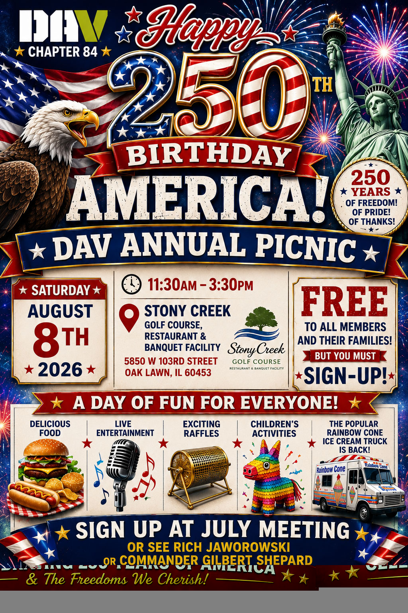

Free to members and immediate family/guests. This year's theme is the 250th birthday of the United States of America.

**Please RSVP so we can get a proper head count and ensure that all picnic attendees have a great time.**


RSVP to Rich J - Senior Vice Commander (SVC@DAV84.us)


Date - Time - Location
- SATURDAY, AUGUST 8TH
- 11:30AM-3:30PM
- STONY CREEK GOLF COURSE
- 5850 W 103RD STREET OAK LAWN, IL 60453

A DAY OF FUN FOR EVERYONE!
DELICIOUS FOOD, LIVE ENTERTAINMENT, EXCITING RAFFLES, CHILDREN'S ACTIVITIES, THE POPULAR RAINBOW CONE ICE CREAM TRUCK IS BACK!

