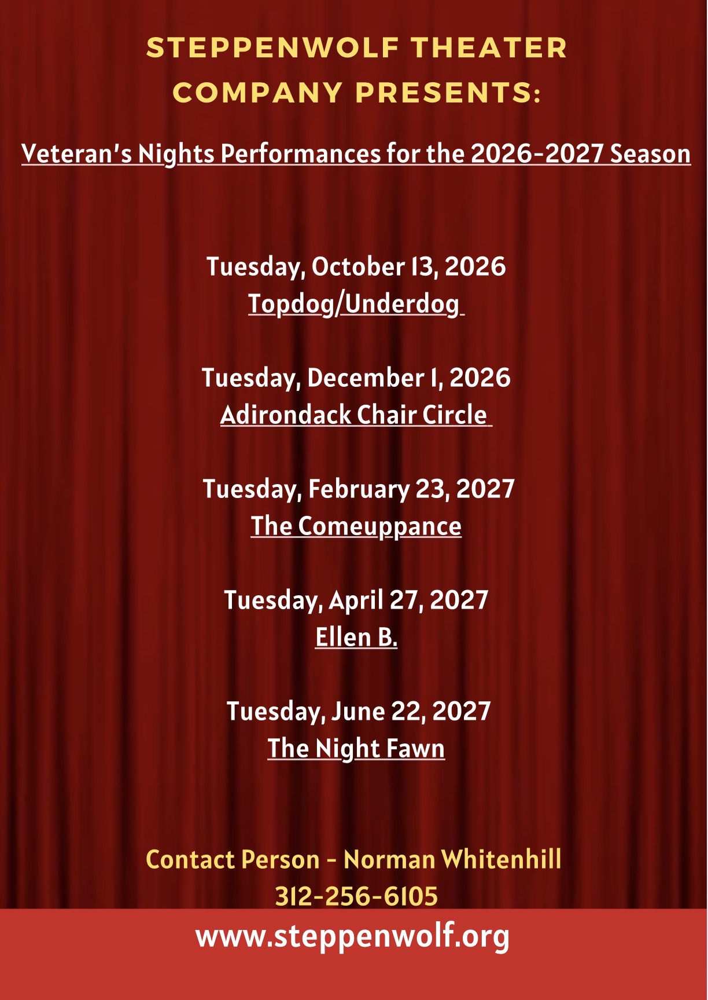

STEPPENWOLF THEATER COMPANY PRESENTS:  
Veteran's Nights Performances for the 2026-2027 Season

**Free Dinner. Free Play. Free Parking.**


Tell them you are with DAV 84 at the door.


Time - Location
- Dinner @ 6pm
- Show Beins @ 7:30pm
- Steppenwolf Theatre Company
- 1650 N Halsted St, Chicago, IL 60614

Dates
- Tuesday, October 13, 2026 Topdog/Underdog.
- Tuesday, December 1, 2026 Adirondack Chair Circle
- Tuesday, February 23, 2027 The Comeuppance
- Tuesday, April 27, 2027 Ellen B.
- Tuesday, June 22, 2027 The Night Fawn

